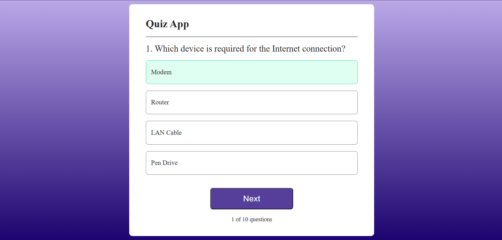

# Quiz App 🧠

A simple **Quiz App built with React.js** where users can answer multiple-choice questions and check their score at the end.

## 📸 Screenshot



## 🚀 Features

* Multiple-choice questions
* Correct and incorrect answer highlighting
* Score tracking
* Next question functionality
* Reset quiz option

## 🛠️ Tech Stack

* React.js
* JavaScript
* CSS
* Vite

## ▶️ Run Locally

```bash
npm install
npm run dev
```

Then open the local URL provided by Vite in your browser.

---

Made with ❤️ using React.js